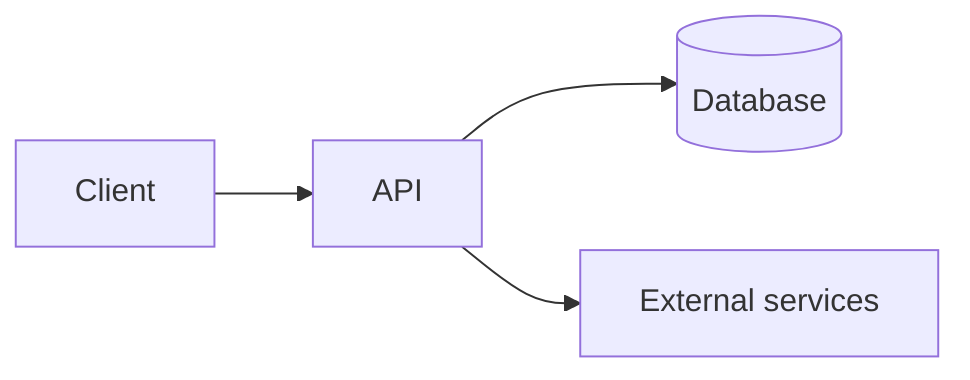

# TRD — Technical Requirements Document: {{PROJECT}}

> Last updated: {{DATE}}
> Document generated with the `vibecoding-docs` skill. Builds on `01-prd.md`.

## Questions to ask (do not copy into the output)
<!--
1. Frontend: web, mobile or both? Which framework? (see the repertoire below)
2. Backend: which language/framework?
3. Database: relational / document / other?
4. Deployment / cloud: where is it hosted?
5. Third-party integrations: auth, payments, email, storage, AI, analytics…
6. Non-functional requirements: performance, security, scalability, compliance.
If the user hesitates, propose a default stack consistent with the platform from the PRD.
-->

## Reference repertoire (to offer options)
- **Web:** React · Vue.js · Angular · Svelte · Next.js · (JavaScript / TypeScript)
- **Mobile:** React Native · Flutter · Swift (iOS) · Kotlin (Android)
- **Backend:** Node.js · .NET · Go · Java · Python (FastAPI/Django) · C#
- **Databases:** PostgreSQL · MySQL · MongoDB · SQLite · Supabase · MS SQL · InfluxDB/TimescaleDB
- **Cloud / deployment:** AWS · Azure · GCP · Vercel · Netlify · Railway · Render
- **Common services:** Auth (Clerk/Auth0/Supabase Auth) · Payments (Stripe) · Email (Resend/SendGrid) ·
  Storage (S3/Cloudflare R2) · AI (Anthropic/OpenAI)

## 1. Overall architecture
3-5 lines plus an optional diagram. Client ↔ API ↔ data ↔ external services.

## 2. Technology stack
| Layer | Technology | Rationale |
|-------|------------|-----------|
| Frontend | | |
| Mobile | | |
| Backend | | |
| Database | | |
| Cloud / hosting | | |

## 3. Integrations and third-party services
| Service | Used for | Notes |
|---------|----------|-------|
| | | |

## 4. Authentication and authorization
Auth method (email/password, OAuth, magic link…), roles and permissions.

## 5. Non-functional requirements
- **Performance:**
- **Security:** (encryption, secrets management, OWASP basics)
- **Scalability:**
- **Availability / backups:**
- **Compliance / privacy:** (GDPR, etc.)

## 6. Environments and deployment
Environments (local / staging / production), CI/CD and key environment variables.
