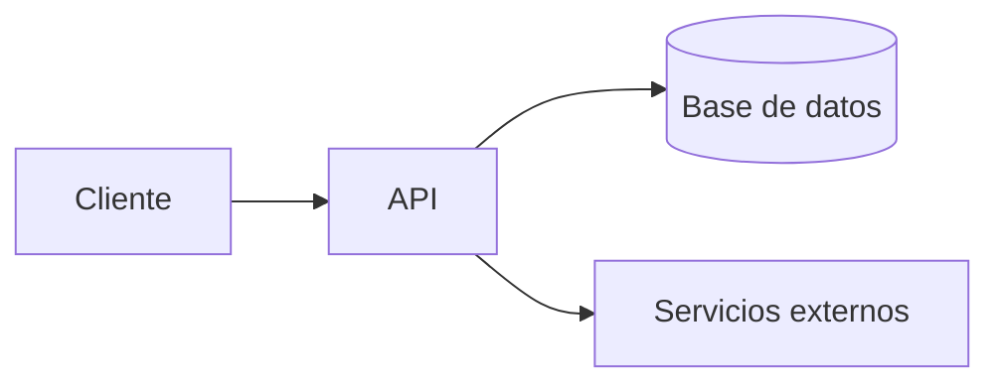

# TRD — Documento de Requisitos Técnicos: {{PROYECTO}}

> Última actualización: {{FECHA}}
> Documento generado con la skill `vibecoding-docs`. Se apoya en `01-prd.md`.

## Preguntas a realizar (no copiar a la salida)
<!--
1. Frontend: ¿web, móvil o ambos? ¿Qué framework? (ver repertorio abajo)
2. Backend: ¿qué lenguaje/framework?
3. Base de datos: ¿relacional / documental / otra?
4. Despliegue / cloud: ¿dónde se hospeda?
5. Integraciones de terceros: auth, pagos, email, almacenamiento, IA, analítica…
6. Requisitos no funcionales: rendimiento, seguridad, escalabilidad, cumplimiento.
Si el usuario duda, propón un stack por defecto coherente con la plataforma del PRD.
-->

## Repertorio de referencia (para ofrecer opciones)
- **Web:** React · Vue.js · Angular · Svelte · Next.js · (JavaScript / TypeScript)
- **Móvil:** React Native · Flutter · Swift (iOS) · Kotlin (Android)
- **Backend:** Node.js · .NET · Go · Java · Python (FastAPI/Django) · C#
- **Bases de datos:** PostgreSQL · MySQL · MongoDB · SQLite · Supabase · MS SQL · InfluxDB/TimescaleDB
- **Cloud / despliegue:** AWS · Azure · GCP · Vercel · Netlify · Railway · Render
- **Servicios comunes:** Auth (Clerk/Auth0/Supabase Auth) · Pagos (Stripe) · Email (Resend/SendGrid) ·
  Storage (S3/Cloudflare R2) · IA (OpenAI/Anthropic)

## 1. Arquitectura general
Descripción en 3-5 líneas + diagrama opcional. Cliente ↔ API ↔ datos ↔ servicios externos.

## 2. Stack tecnológico
| Capa | Tecnología | Motivo |
|------|------------|--------|
| Frontend | | |
| Móvil | | |
| Backend | | |
| Base de datos | | |
| Cloud / hosting | | |

## 3. Integraciones y servicios de terceros
| Servicio | Uso | Notas |
|----------|-----|-------|
| | | |

## 4. Autenticación y autorización
Método de auth (email/contraseña, OAuth, magic link…), roles y permisos.

## 5. Requisitos no funcionales
- **Rendimiento:**
- **Seguridad:** (cifrado, gestión de secretos, OWASP básicos)
- **Escalabilidad:**
- **Disponibilidad / backups:**
- **Cumplimiento / privacidad:** (GDPR, etc.)

## 6. Entornos y despliegue
Entornos (local / staging / producción), CI/CD y variables de entorno clave.
