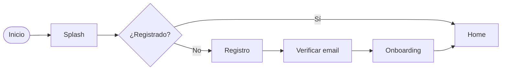

# AppFlow — Flujo de la aplicación: {{PROYECTO}}

> Última actualización: {{FECHA}}
> Documento generado con la skill `vibecoding-docs`. Se apoya en `01-prd.md` y `03-ui-ux.md`.

## Preguntas a realizar (no copiar a la salida)
<!--
1. ¿Cuáles son las pantallas/vistas principales?
2. Flujo de entrada: ¿splash, registro, login? ¿Qué métodos (email, Google, Apple…)?
3. ¿Hay onboarding? ¿Qué pasos?
4. ¿Cuál es el "happy path" (recorrido principal) del usuario una vez dentro?
5. Estados especiales: vacío, error, sin conexión, permisos.
-->

## 1. Mapa de pantallas
Lista de pantallas con su propósito.

| Pantalla | Propósito | Acciones principales |
|----------|-----------|----------------------|
| Splash | | |
| Registro / Login | | |
| Onboarding | | |
| Home / Dashboard | | |
| … | | |

## 2. Diagrama de flujo

> Ajusta el diagrama al flujo real del proyecto.

## 3. Recorrido principal (happy path)
Paso a paso de la acción clave que aporta valor (p. ej. crear una tarea, publicar, comprar).

1. …
2. …
3. …

## 4. Navegación
Estructura de navegación (tab bar / drawer / stack) y cómo se mueve el usuario entre secciones.

## 5. Estados y casos límite
- Estado vacío:
- Errores y validaciones:
- Sin conexión / carga:
- Permisos (cámara, notificaciones, ubicación):
