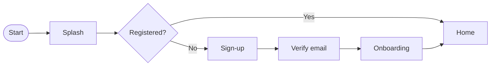

# AppFlow — Application flow: {{PROJECT}}

> Last updated: {{DATE}}
> Document generated with the `vibecoding-docs` skill. Builds on `01-prd.md` and `03-ui-ux.md`.

## Questions to ask (do not copy into the output)
<!--
1. What are the main screens/views?
2. Entry flow: splash, sign-up, login? Which methods (email, Google, Apple…)?
3. Is there an onboarding? Which steps?
4. What is the user's "happy path" once inside?
5. Special states: empty, error, offline, permissions.
-->

## 1. Screen map
List of screens and their purpose.

| Screen | Purpose | Main actions |
|--------|---------|--------------|
| Splash | | |
| Sign-up / Login | | |
| Onboarding | | |
| Home / Dashboard | | |
| … | | |

## 2. Flow diagram

> Adapt the diagram to the project's real flow.

## 3. Happy path
Step by step of the key value-delivering action (e.g. create a task, publish, buy).

1. …
2. …
3. …

## 4. Navigation
Navigation structure (tab bar / drawer / stack) and how the user moves between sections.

## 5. States and edge cases
- Empty state:
- Errors and validation:
- Offline / loading:
- Permissions (camera, notifications, location):
