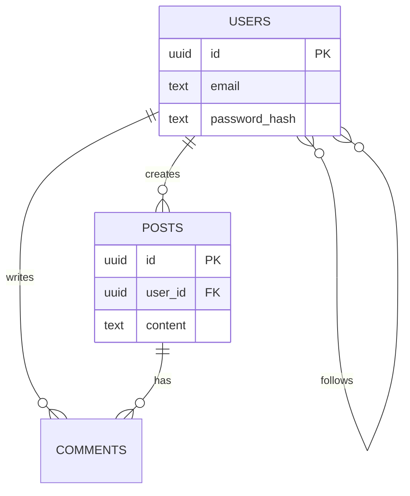

# BackEnd Schema — Data model: {{PROJECT}}

> Last updated: {{DATE}}
> Document generated with the `vibecoding-docs` skill. Derives the entities from `01-prd.md`.

## Questions to ask (do not copy into the output)
<!--
1. What are the main entities? (often derived from the PRD features)
2. How do they relate? (1-1, 1-N, N-M)
3. User/auth model: what data does a user hold?
4. Is there sensitive data needing special care (encryption, retention)?
Propose an initial schema and let the user correct it.
-->

## 1. Entities
For each entity, its fields and types. Convention: `id` (PK), `*_id` (FK), `created_at`, `updated_at`.

### users
| Field | Type | Notes |
|-------|------|-------|
| id | uuid/serial | PK |
| email | text | unique |
| password_hash | text | |
| created_at | timestamp | |
| updated_at | timestamp | |

### (another entity)
| Field | Type | Notes |
|-------|------|-------|
| | | |

## 2. Relationships (ER diagram)

> Adapt entities, fields and cardinalities to the real project.

## 3. Indexes and constraints
- Unique keys:
- Indexes for frequent queries:
- Integrity rules / on delete:

## 4. Security notes and sensitive data
- Encrypted / hashed fields:
- Retention / deletion policy:
- Personal data (PII) and how it is handled:
