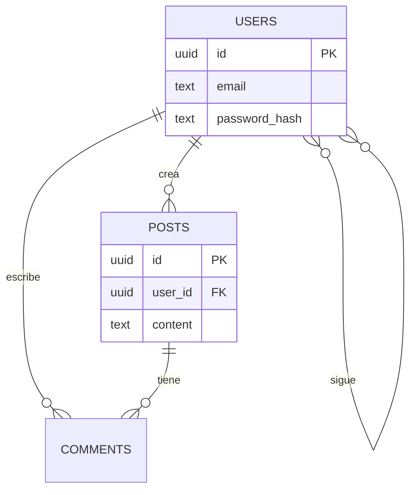

# Esquema del BackEnd — Modelo de datos: {{PROYECTO}}

> Última actualización: {{FECHA}}
> Documento generado con la skill `vibecoding-docs`. Deriva las entidades de `01-prd.md`.

## Preguntas a realizar (no copiar a la salida)
<!--
1. ¿Cuáles son las entidades principales? (a menudo se deducen de las funcionalidades del PRD)
2. ¿Cómo se relacionan? (1-1, 1-N, N-M)
3. Modelo de usuarios/auth: ¿qué datos guarda un usuario?
4. ¿Hay datos sensibles que requieran cuidado especial (cifrado, retención)?
Propón un esquema inicial y deja que el usuario lo corrija.
-->

## 1. Entidades
Para cada entidad, sus campos y tipos. Convención: `id` (PK), `*_id` (FK), `created_at`, `updated_at`.

### users
| Campo | Tipo | Notas |
|-------|------|-------|
| id | uuid/serial | PK |
| email | text | único |
| password_hash | text | |
| created_at | timestamp | |
| updated_at | timestamp | |

### (otra entidad)
| Campo | Tipo | Notas |
|-------|------|-------|
| | | |

## 2. Relaciones (diagrama ER)

> Ajusta entidades, campos y cardinalidades al proyecto real.

## 3. Índices y restricciones
- Claves únicas:
- Índices para consultas frecuentes:
- Reglas de integridad / on delete:

## 4. Notas de seguridad y datos sensibles
- Campos cifrados / hasheados:
- Política de retención / borrado:
- Datos personales (PII) y su tratamiento:
